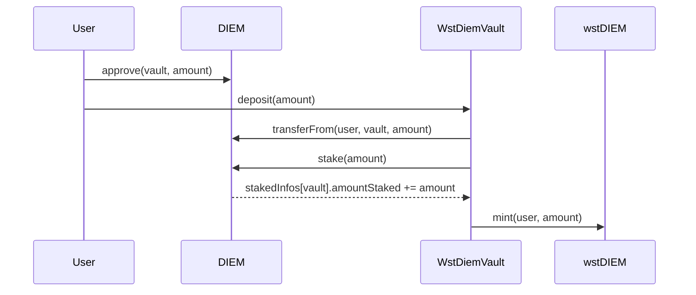

# wstDIEM MVP Architecture

> End-to-end design for a contract-controlled wstDIEM MVP on Base: deposit DIEM, stake it through the DIEM contract, mint wstDIEM, provision Venice inference keys from the staked DIEM allowance, and redeem wstDIEM back to DIEM through the 24-hour unstake cooldown.

## External references

See [Venice DIEM Contract and API Research](references/venice-diem-contract-and-api-research.md) for the researched sources behind this design.

Core facts used here:

- DIEM is on Base at `0xf4d97f2da56e8c3098f3a8d538db630a2606a024`.
- DIEM has 18 decimals.
- The same DIEM contract exposes staking methods: `stake(uint256)`, `initiateUnstake(uint256)`, `unstake()`.
- `cooldownDuration()` is `86400` seconds / `1 day`.
- Venice pricing says `1 Diem = $1/day of compute`.
- Venice API keys can be `ADMIN` or `INFERENCE`.
- API key consumption limits include a `diem` field and `EPOCH` reset window.
- `GET /billing/balance` returns remaining DIEM balance and `diemEpochAllocation`.

## MVP goal

A user should be able to:

1. connect/authenticate with Privy;
2. deposit DIEM into the wstDIEM vault;
3. receive `wstDIEM` 1:1;
4. receive one Venice inference key associated with their wallet;
5. spend Venice inference up to their current `wstDIEM` balance-denominated allowance;
6. request redemption of `wstDIEM` back to DIEM;
7. wait through the 24-hour DIEM cooldown;
8. claim DIEM back after the vault completes the unstake batch.

## System overview

```mermaid
flowchart TD
  User[User wallet] -->|Privy auth + wallet connect| App[Next.js wstDIEM app]
  User -->|approve DIEM| Diem[Diem token + staking contract]
  User -->|deposit DIEM| Vault[wstDIEMVault]
  Vault -->|stake(amount)| Diem
  Vault -->|mint 1:1| Wst[wstDIEM ERC-20]

  App -->|authenticated API call| Backend[wstDIEM API]
  Backend --> Registry[(Key registry)]
  Backend --> Sync[Allowance sync worker]
  Sync -->|read balanceOf + redemption state| Vault
  Sync -->|create/update/delete inference keys| Venice[Venice API]
  Venice --> UserKey[User inference key]

  User -->|requestRedeem(wstDIEM)| Vault
  Vault -->|batch initiateUnstake(total)| Diem
  Vault -->|after 24h: unstake()| Diem
  User -->|claim DIEM| Vault
```

## Contract design

### Contracts

| Contract | Purpose |
| --- | --- |
| `WstDiem` | ERC-20-compatible receipt token minted/burned only by the vault. For V1, it should be non-transferable or transfer-restricted unless a protocol inference proxy/global epoch ledger is implemented. |
| `WstDiemVault` | Holds/stakes DIEM, handles deposits, batched redemption requests, cooldown completion, and DIEM claims. |

### Deposit flow



Deposit rules:

- User approves the vault to spend DIEM.
- Vault transfers DIEM from user to vault.
- Vault immediately calls `DIEM.stake(amount)`.
- DIEM's `stake()` moves DIEM from the vault's balance into the DIEM contract's staked balance for `msg.sender = vault`.
- Vault mints `wstDIEM` to the user 1:1.
- `Deposit(user, amount)` event is emitted.

Suggested Solidity API:

```solidity
function deposit(uint256 amount) external returns (uint256 wstDiemMinted);
function depositFor(address receiver, uint256 amount) external returns (uint256 wstDiemMinted);
```

MVP invariant:

```text
wstDIEM totalSupply + pendingRedeemPrincipal <= vault active stake + vault cooldown amount + vault liquid DIEM reserved for claims
```

### Redemption and unstake challenge

The DIEM staking contract has only one cooldown bucket per staking address:

```solidity
stakedInfos[address].amountStaked
stakedInfos[address].coolDownEnd
stakedInfos[address].coolDownAmount
```

Calling `initiateUnstake(amount)` while a cooldown is already active increases `coolDownAmount` but resets `coolDownEnd` for the full aggregate cooldown amount. Therefore, the vault must not call `initiateUnstake()` for every user redemption request. That would let later requests grief earlier requests by extending their cooldown.

### Redemption batch model

The MVP should implement a single active cooldown batch and a queue for the next batch.

States:

| State | Meaning |
| --- | --- |
| `OPEN` | Collecting redemption requests for the next unstake. |
| `COOLING_DOWN` | Vault already called `DIEM.initiateUnstake(batchAmount)` and is waiting 24h. |
| `READY_TO_COMPLETE` | `block.timestamp >= coolDownEnd`; anyone can call `completeUnstakeBatch()`. |
| `CLAIMABLE` | Vault has called `DIEM.unstake()` and users in the batch can claim DIEM. |

Recommended model:

- `requestRedeem(amount)` burns or locks the user's `wstDIEM` immediately, removing it from inference eligibility.
- If no batch is cooling down, request goes into the current open batch.
- `startUnstakeBatch()` closes the open batch and calls `DIEM.initiateUnstake(totalAmount)` once.
- During the 24h cooldown, new redemption requests are recorded into the next open batch but not initiated.
- After 24h, `completeUnstakeBatch()` calls `DIEM.unstake()` once, receives the cooled DIEM back into the vault, and marks the batch claimable.
- Users call `claimRedeemed(batchId)` to receive DIEM.
- After the active cooldown batch is completed, the next open batch can be started.

```mermaid
sequenceDiagram
  participant U1 as User A
  participant U2 as User B
  participant V as WstDiemVault
  participant D as DIEM

  U1->>V: requestRedeem(10 wstDIEM)
  V-->>V: burn/escrow 10 wstDIEM, add to open batch
  U2->>V: requestRedeem(5 wstDIEM)
  V-->>V: burn/escrow 5 wstDIEM, add to open batch
  V->>D: initiateUnstake(15 DIEM)
  D-->>V: coolDownEnd = now + 86400
  Note over V,D: New requests wait in next batch; do not reset this cooldown.
  V->>D: unstake() after 24h
  D-->>V: transfer 15 DIEM to vault
  U1->>V: claimRedeemed(batchId)
  V-->>U1: transfer 10 DIEM
  U2->>V: claimRedeemed(batchId)
  V-->>U2: transfer 5 DIEM
```

Suggested Solidity API:

```solidity
function requestRedeem(uint256 amount) external returns (uint256 batchId);
function startUnstakeBatch() external returns (uint256 batchId, uint256 amount, uint256 readyAt);
function completeUnstakeBatch(uint256 batchId) external;
function claimRedeemed(uint256 batchId) external returns (uint256 diemAmount);
function previewRedeem(address user) external view returns (...);
```

Recommended events:

```solidity
event Deposited(address indexed user, uint256 amount);
event RedeemRequested(address indexed user, uint256 indexed batchId, uint256 amount);
event UnstakeBatchStarted(uint256 indexed batchId, uint256 amount, uint256 readyAt);
event UnstakeBatchCompleted(uint256 indexed batchId, uint256 amount);
event RedeemClaimed(address indexed user, uint256 indexed batchId, uint256 amount);
```

### Allowance impact of redemption

When a user calls `requestRedeem(amount)`, their Venice allowance should decrease immediately because the `wstDIEM` is no longer active exposure.

Eligibility formula for MVP:

```text
eligibleDiem(user) = wstDIEM.balanceOf(user)
```

Do not count pending redemption amounts as eligible inference capacity.

### Critical V1 transferability decision

A transferable `wstDIEM` token creates a same-epoch allowance double-spend problem if users can call Venice directly with their inference keys:

```text
1. Alice holds 100 wstDIEM and receives a 100 DIEM EPOCH key limit.
2. Alice spends the full 100 DIEM allowance early in the UTC day.
3. Alice transfers 100 wstDIEM to Bob before the epoch resets.
4. A naive sync sets Bob's key limit to 100 DIEM, allowing another 100 DIEM of potential spend backed by the same stake.
```

For the MVP, choose one of these before implementation:

| Option | Recommendation | Notes |
| --- | --- | --- |
| Non-transferable V1 `wstDIEM` | **Recommended** | Block normal ERC-20 transfers until the product has robust usage accounting. Mint on deposit and burn/escrow on redeem only. This makes `balanceOf(wallet)` a safe allowance source. |
| Transferable with protocol API proxy | Possible later | Users call the protocol proxy, not Venice directly. The proxy enforces global per-epoch usage and prevents double-spend across transfers. More complex and less composable. |
| Transferable with direct Venice keys only | **Not recommended for V1** | Key limits can lag transfers/redemptions and cannot claw back already-spent same-epoch allowance. |

If V1 must expose a standard transferable ERC-20, then the docs/implementation need an additional per-epoch spent ledger and conservative limit formula before launch:

```text
availableLimit(wallet, epoch) = max(0, activeBalance(wallet) - alreadySpentByWallet(epoch) - protocolReserve)
```

Even that does not fully solve transfer-after-spend without either non-transferability, a protocol inference proxy, or a global epoch allocation scheduler.

## Venice API key provisioning

### Admin key model

The protocol needs one Venice `ADMIN` key controlled by the protocol backend. This key creates, updates, and deletes user `INFERENCE` keys.

The admin key's account should correspond to the DIEM staked by the wstDIEM vault. The first E2E test after deployment should verify:

```text
DIEM.stakedInfos(wstDIEMVault).amountStaked == expected amount
GET /billing/balance using protocol admin key returns diemEpochAllocation consistent with that staked amount
```

If Venice cannot attribute contract-staked DIEM to an admin key, the integration must be resolved with Venice before production launch. The smart contract still remains the staking/custody source of truth.

### User key model

- One active Venice `INFERENCE` key per wallet.
- User authenticates with Privy and the backend verifies the wallet identity.
- Backend creates a Venice inference key with:
  - `apiKeyType: "INFERENCE"`
  - `description: "wstDIEM <wallet>"`
  - `limitPeriod: "EPOCH"`
  - `consumptionLimits: { "diem": eligibleDiem }`
- Backend stores Venice key metadata and encrypted key material.
- User can recreate/rotate a key, but rotation should be rate-limited.

Suggested key recreation policy:

```text
User can rotate at most once per 24h by default.
Emergency admin override can revoke/rotate faster if a key is compromised.
Rotation deletes/revokes the old Venice key before or immediately after creating the new key.
```

### API endpoints

Suggested backend routes:

| Route | Purpose |
| --- | --- |
| `POST /api/auth/session` | Verify Privy identity token and resolve wallet. |
| `GET /api/me` | Return wallet, wstDIEM balance, pending redemptions, key status, and allowance. |
| `POST /api/keys` | Create user's Venice inference key if missing. |
| `GET /api/keys/current` | Return masked key metadata and optionally the encrypted/recoverable key. |
| `POST /api/keys/rotate` | Revoke old key and create a new key, subject to cooldown. |
| `POST /api/sync/me` | Trigger immediate sync for authenticated wallet. |
| `POST /api/cron/sync-allowances` | Batch sync active wallets. |

### Sync worker

The sync worker should update Venice key limits whenever a user's active `wstDIEM` balance changes.

Inputs:

- `wstDIEM.balanceOf(wallet)`
- key registry row for wallet
- redemption state from vault, if needed for UI
- protocol admin key

Output:

- Venice API key `consumptionLimits.diem = eligibleDiem(wallet)` with `limitPeriod = EPOCH`

Rules:

- `eligibleDiem = 0`: set key limit to zero or delete/revoke key.
- Balance increased: update key limit after transaction finality.
- Balance decreased or redemption requested: lower key limit immediately.
- Sum of active key limits should not exceed staked DIEM allocation after any protocol reserve factor.
- Sync should be idempotent and auditable.

Recommended audit row:

| Field | Purpose |
| --- | --- |
| `wallet_address` | User wallet. |
| `venice_key_id` | Venice key ID. |
| `old_diem_limit` | Previous DIEM limit. |
| `new_diem_limit` | Updated DIEM limit. |
| `wstdiem_balance` | On-chain balance used. |
| `tx_or_block_number` | Chain state reference. |
| `status` | Success/error. |
| `error` | Sanitized error text. |
| `created_at` | Timestamp. |

## Privy authentication and wallet ownership

Use Privy similarly to Surplus Intelligence:

- Frontend provider stack: `@privy-io/react-auth` with `@privy-io/wagmi`.
- Supported chain: Base.
- Login methods can include wallet and social/email, but key ownership must resolve to a Base wallet.
- Server verifies Privy identity tokens with `@privy-io/server-auth`.
- Backend routes should trust only server-verified wallet addresses, not client-submitted wallet strings.

Recommended MVP rule:

```text
The wallet that owns the wstDIEM balance is the wallet that owns the Venice inference key.
```

If a user logs in with email/social and Privy creates or links an embedded wallet, the app must clearly show which Base wallet is being used for wstDIEM/key ownership.

## Key storage and recovery

Venice docs say API keys are shown once. For MVP, support both safe display and recoverability:

### Recommended MVP approach

- Store `venice_key_id`, `last6Chars`, status, and limits in plain metadata.
- Store raw key material encrypted at rest using server-side envelope encryption.
- Return/decrypt raw key only after Privy-authenticated wallet verification.
- Log every key reveal event.
- Let user rotate/recreate key after cooldown.

### Do not store raw bearer keys on-chain

A Venice inference key is a bearer secret. Even encrypted ciphertext on-chain is public forever and difficult to rotate. The smart contract can optionally store a non-secret commitment:

```solidity
mapping(address => bytes32) public keyCommitment;
```

But the MVP should store recoverable encrypted key material off-chain and use the contract only for DIEM/wstDIEM state.

## Frontend MVP screens

### 1. Connect / overview

Shows:

- Privy login/connect wallet
- wallet address
- DIEM balance
- wstDIEM balance
- current Venice allowance
- current key status
- pending redemption batches

### 2. Deposit

Flow:

1. Enter DIEM amount.
2. Approve DIEM to vault.
3. Call `deposit(amount)`.
4. Show minted `wstDIEM`.
5. Trigger allowance sync.
6. Show key creation CTA if no key exists.

### 3. API key / inference

Flow:

1. User clicks `Create Venice key`.
2. Backend creates one inference key through protocol admin key.
3. App shows the key once and stores encrypted key material.
4. User can copy OpenAI-compatible examples:

```bash
curl https://api.venice.ai/api/v1/chat/completions \
  -H "Authorization: Bearer $VENICE_API_KEY" \
  -H "Content-Type: application/json" \
  -d '{"model":"venice-uncensored","messages":[{"role":"user","content":"hello"}]}'
```

5. App shows remaining DIEM allowance from `/billing/balance` if available.

### 4. Redeem / withdraw

Flow:

1. Enter `wstDIEM` amount.
2. App explains the 24h cooldown.
3. User calls `requestRedeem(amount)`.
4. wstDIEM is burned/escrowed immediately.
5. User allowance decreases on next sync.
6. Request enters open batch or next batch.
7. App shows estimated `readyAt` once batch starts.
8. After cooldown, anyone can call `completeUnstakeBatch()`.
9. User clicks `Claim DIEM` to receive DIEM.

## Backend/data model

Suggested tables:

### `users`

| Field | Purpose |
| --- | --- |
| `wallet_address` | Primary user identity. |
| `privy_user_id` | Optional Privy user mapping. |
| `created_at` | Created timestamp. |
| `last_seen_at` | Last login timestamp. |

### `venice_keys`

| Field | Purpose |
| --- | --- |
| `wallet_address` | Owner wallet. |
| `venice_key_id` | Venice API key ID. |
| `last6_chars` | Display hint. |
| `encrypted_key` | Encrypted raw key material. |
| `status` | active, revoked, rotating, error. |
| `current_diem_limit` | Current EPOCH DIEM limit. |
| `last_rotated_at` | Rotation cooldown enforcement. |
| `created_at` | Created timestamp. |
| `updated_at` | Updated timestamp. |

### `allowance_sync_log`

See sync worker audit fields above.

### `redeem_batches_cache` (optional)

The contract is source of truth, but caching batch status makes UI faster.

## Implementation phases

### Phase 1: Contract MVP

- Add Foundry or Hardhat.
- Implement `WstDiem` ERC-20.
- Implement `WstDiemVault` deposit/stake path.
- Implement redemption batches around the single DIEM cooldown bucket.
- Add tests for deposit, batch cooldown, claim, and grief prevention.
- Add fork tests against Base DIEM ABI if feasible.

### Phase 2: Backend + Venice adapter

- Add backend routes for Privy auth, user profile, key create/get/rotate, and sync.
- Implement Venice admin adapter:
  - `createInferenceKey(wallet, diemLimit)`
  - `updateInferenceKeyLimit(keyId, diemLimit)`
  - `deleteInferenceKey(keyId)`
  - `getBillingBalance()`
- Add encrypted key storage.
- Add sync job and audit logs.

### Phase 3: Next.js app

- Convert the current static app into a Next.js app.
- Add Privy provider and Base wagmi config.
- Add deposit/redeem/key screens.
- Add transaction status and batch countdown UI.
- Add OpenAI-compatible Venice usage examples.

### Phase 4: E2E test with real DIEM

With a small amount of DIEM:

1. Deploy contracts on Base.
2. Deposit DIEM through app.
3. Verify `stakedInfos(vault).amountStaked` increased.
4. Verify protocol Venice admin key sees matching DIEM allocation in `/billing/balance`.
5. Create user inference key with `consumptionLimits.diem = user wstDIEM balance`.
6. Make a Venice inference call with the user key.
7. Request redemption.
8. Verify user's key allowance decreases.
9. Wait 24h or use a testnet/mock cooldown in local tests.
10. Complete unstake and claim DIEM.

## Acceptance criteria for fully working MVP

- DIEM deposits stake on-chain through the vault.
- wstDIEM is minted 1:1 after successful staking.
- User can create exactly one active Venice inference key for their wallet.
- Venice key allowance is denominated in DIEM and tracks active wallet-held wstDIEM.
- Redemption burns/locks wstDIEM immediately and lowers allowance.
- Redemption uses DIEM's 24h `initiateUnstake()` / `unstake()` flow.
- Batching prevents later redemption requests from resetting an already-active cooldown.
- User can claim DIEM after the batch is completed.
- Privy authentication prevents one wallet from reading or rotating another wallet's key.
- No Venice admin key or user inference key is exposed in client bundles, GitHub, logs, or on-chain plaintext.
- V1 transferability decision is explicit: either non-transferable receipt token or a protocol-enforced epoch usage ledger/proxy.

## External DIEM/Venice trust risks

wstDIEM inherits risks from Venice/DIEM contracts and APIs:

- DIEM admin/minter-burner roles can affect the backing asset. A Venice admin or compromised role holder could mint/burn/alter DIEM supply or operational assumptions.
- DIEM `cooldownDuration` is externally administered. If it changes from 24h, the vault UI and batch logic must read it dynamically rather than hard-code one day.
- Venice API key semantics and DIEM account attribution are off-chain API dependencies. API behavior can change independently of the vault.
- If Venice account-level daily allocation is lower than the sum of user key limits, user keys may fail even if their local key limit appears valid. The sync worker should compare aggregate active user limits to `/billing/balance.diemEpochAllocation` and apply a reserve factor.

These are acceptable for an MVP only if surfaced clearly in UI/docs and covered by the real-DIEM E2E test.

## Known risk / required confirmation before production

The core remaining integration question is Venice account attribution for contract-staked DIEM. The vault can stake DIEM on-chain, but the backend needs a protocol admin key whose `diemEpochAllocation` reflects the vault's staked DIEM. The MVP E2E test must prove contract-staked DIEM attribution before calling the product production-ready.
