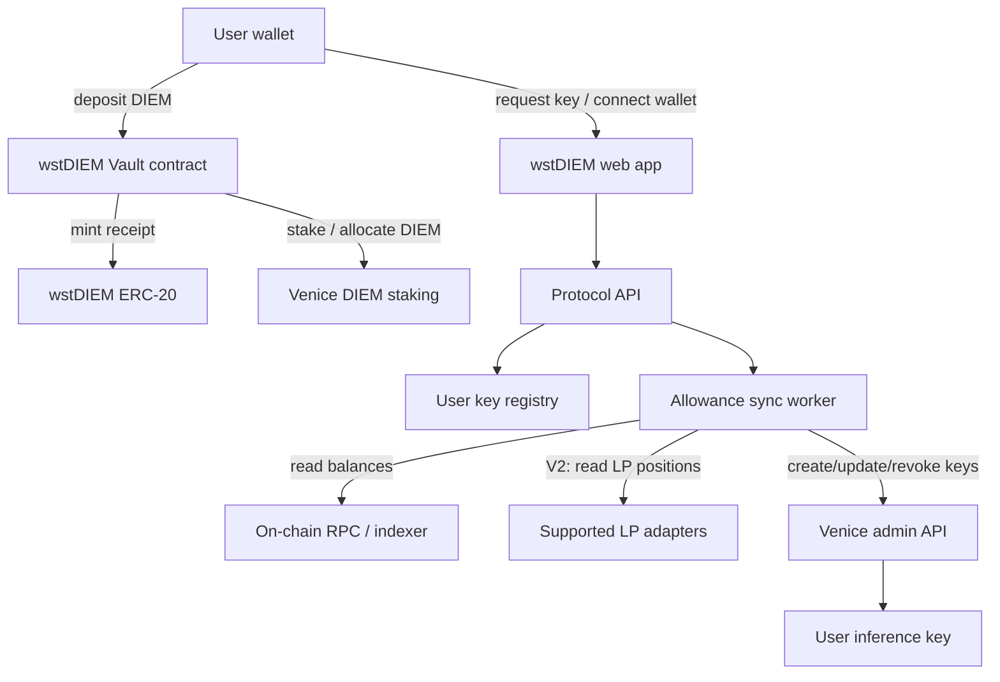
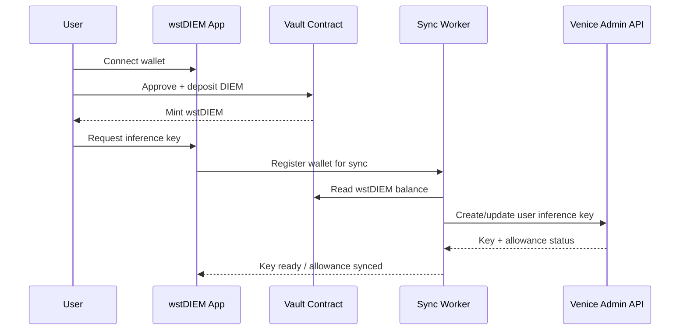

# wstDIEM Protocol Plan

> Planning document for a wrapped staked DIEM protocol that turns Venice.ai DIEM staking into wallet-based inference access.

## Summary

`wstDIEM` is a wrapped staked version of Venice's `DIEM` token.

Users deposit DIEM into a protocol-controlled staking flow and receive `wstDIEM` as the on-chain receipt token. The protocol stakes the underlying DIEM with Venice.ai, operates a Venice admin account/API key, and issues per-user inference keys whose allowance is synced to each user's eligible `wstDIEM` exposure.

The key idea: **holding wstDIEM should grant Venice inference capacity without each user needing to manage Venice staking or admin-key infrastructure directly.**

## Goals

- Let users deposit DIEM and receive a transferable receipt token: `wstDIEM`.
- Stake the pooled DIEM with Venice.ai so it backs inference capacity.
- Issue Venice inference keys to users from a protocol-controlled Venice admin account.
- Sync each user's inference allowance to their eligible `wstDIEM` balance.
- Start with a simple V1 balance-based model, then expand V2 to include LP-held `wstDIEM`.

## Non-goals for the first implementation

- No fully trustless Venice account administration in V1 if Venice admin APIs require off-chain credentials.
- No complex LP/oracle accounting in V1.
- No lending, leverage, restaking, or external rewards routing in V1.
- No on-chain storage of Venice admin secrets or user inference keys.

## Product versions

### V1: Wallet balance based sync

V1 grants inference allowance based only on the user's wallet-held `wstDIEM` balance.

Example rule:

```text
eligible_wstDIEM = wstDIEM.balanceOf(user_wallet)
venice_allowance = eligible_wstDIEM * allowance_rate
```

V1 should prove the full loop works:

1. User deposits DIEM.
2. User receives `wstDIEM`.
3. Protocol stakes/allocates backing DIEM on Venice.
4. User requests or connects an inference key.
5. Sync worker reads the user's `wstDIEM` balance.
6. Sync worker creates/updates the user's Venice inference key allowance.
7. If the user transfers or burns `wstDIEM`, the next sync lowers their allowance.

### V2: Wallet balance + LP position sync

V2 expands eligibility to include `wstDIEM` that a user has deposited into supported liquidity positions.

Example rule:

```text
eligible_wstDIEM = wallet_wstDIEM + supported_lp_wstDIEM_exposure
venice_allowance = eligible_wstDIEM * allowance_rate
```

V2 should only count LP positions that the protocol can verify safely. For example:

- specific approved pools only;
- position ownership verified on-chain;
- `wstDIEM` share calculated from pool reserves or concentrated-liquidity position math;
- optional time-weighted balance to reduce flash-loan or same-block gaming;
- clear handling for withdrawn, transferred, or out-of-range LP positions.

## High-level architecture



## Components

### 1. `wstDIEM` token

A standard ERC-20 receipt token minted when users deposit DIEM.

Initial recommendation:

- non-rebasing ERC-20;
- 18 decimals unless DIEM differs;
- mint/burn only through the vault;
- simple transferability so users can move positions between wallets;
- optional permit support for better UX.

Open decision: whether `wstDIEM` should always be 1:1 with deposited DIEM, or whether it should represent vault shares if the underlying staking position has deposits, withdrawals, slashing, rewards, or accounting drift.

### 2. Vault / staking contract

The vault receives DIEM and issues `wstDIEM`.

Responsibilities:

- accept DIEM deposits;
- mint `wstDIEM` receipts;
- burn `wstDIEM` on withdrawal;
- expose total assets / total supply views;
- emit events for off-chain sync and analytics;
- enforce pausing and emergency controls.

Important design question: **where does the staked DIEM live?**

Preferred path if Venice staking is on-chain:

- the vault or a controlled staking adapter stakes DIEM directly;
- withdrawals are handled by the vault with any Venice cooldown/unstake delay;
- operator cannot custody user DIEM outside contract rules.

Fallback path if Venice staking requires off-chain account custody:

- document the trust assumption explicitly;
- keep operator privileges narrow and observable;
- publish proof-of-reserves / staked-balance reports;
- prioritize a future migration to direct on-chain staking if Venice supports it.

### 3. Venice account manager

A service that owns or controls the protocol's Venice.ai account integration.

Responsibilities:

- create or configure the protocol Venice account;
- stake pooled DIEM with Venice;
- securely store the Venice admin API key;
- rotate the admin key if compromised;
- expose a narrow internal API for the sync worker.

Security rule: **the Venice admin API key must never be written on-chain, committed to GitHub, exposed to the browser, or included in client-side logs.**

### 4. User key registry

A database mapping wallets to Venice inference keys.

Suggested fields:

| Field | Purpose |
| --- | --- |
| `wallet_address` | User's EVM wallet |
| `venice_key_id` | Venice-side key identifier, not necessarily the raw key |
| `encrypted_key_material` | Optional if the protocol needs to display/recover the key |
| `current_allowance` | Last synced allowance |
| `last_balance_snapshot` | Wallet / LP balances used in the last sync |
| `last_synced_at` | Last successful Venice sync timestamp |
| `status` | Active, throttled, revoked, pending, error |

Key material should be encrypted at rest. If Venice supports key display only at creation time, the app should show the key once and store only its identifier plus metadata.

### 5. Balance and allowance sync worker

A recurring service that converts eligible `wstDIEM` exposure into Venice inference allowance.

V1 reads:

- `wstDIEM.balanceOf(wallet)`

V2 additionally reads:

- supported LP positions owned by the wallet;
- `wstDIEM` exposure inside each position;
- optional time-weighted exposure.

The worker should be idempotent. Running it twice with unchanged balances should not create duplicate keys or duplicate allowance updates.

## V1 user flow



## V2 LP accounting model

V2 needs a modular LP adapter layer so the protocol can support one pool type at a time.

Adapter interface concept:

```text
getEligibleExposure(wallet) -> wstDIEM_amount
```

Each adapter should define:

- supported chain;
- supported pool addresses;
- ownership proof method;
- reserve / position math;
- minimum liquidity threshold;
- whether exposure is spot balance or time-weighted;
- known edge cases.

Potential V2 rules:

- Count wallet-held `wstDIEM` at 100%.
- Count LP-held `wstDIEM` at 100% of the user's computed `wstDIEM` side of supported pools.
- Optionally apply an LP bonus if the protocol wants to incentivize liquidity.
- Apply time-weighted balance windows before increasing allowance.
- Decrease allowance quickly when wallet or LP exposure falls.

## Allowance policy

The exact DIEM-to-inference conversion depends on Venice's staking economics and API semantics. The protocol should keep the policy configurable.

Example config shape:

```json
{
  "allowanceRatePerWstDiem": "TBD",
  "minWstDiemForKey": "TBD",
  "syncIntervalSeconds": 900,
  "increaseDelaySeconds": 3600,
  "decreaseDelaySeconds": 0,
  "lpExposureEnabled": false,
  "supportedLpAdapters": []
}
```

Recommended behavior:

- Use a minimum threshold to avoid creating many dust keys.
- Increase allowance after balance confirmation and optional delay.
- Decrease allowance immediately or near-immediately when balances fall.
- Keep allowance calculations deterministic and logged.
- Store each sync input/output for auditability.

## Security and trust model

### On-chain risks

- Vault accounting bugs could over-mint or under-collateralize `wstDIEM`.
- Withdrawal logic must account for Venice unstaking delays or limits.
- Admin/pauser roles must be tightly controlled.
- LP accounting in V2 can be gamed if it relies only on spot balances.

### Off-chain risks

- Venice admin API key compromise could affect all user inference keys.
- Sync worker bugs could over-allocate or fail to revoke inference.
- Venice API outages could delay key updates.
- If staking requires off-chain custody, users rely on operator honesty and proof-of-reserves.

### Mitigations

- Never expose Venice admin key to browser clients.
- Use a secrets manager for admin credentials.
- Keep a full audit log of key creation and allowance changes.
- Rate-limit key creation and API calls.
- Add emergency pause for deposits and key issuance.
- Use multisig/timelock for contract admin roles.
- Start V2 LP support with one audited adapter before adding more pools.

## Open questions

| Question | Why it matters |
| --- | --- |
| What chain and contract address is DIEM on? | Determines vault deployment and LP integrations. |
| Is Venice DIEM staking on-chain, API-driven, or both? | Determines whether staking can be trust-minimized. |
| Does Venice expose admin APIs for child inference keys and allowance updates? | Determines backend architecture and sync mechanics. |
| What is the exact unit of inference allowance? | Needed for the `wstDIEM -> allowance` formula. |
| Can allowances be reduced/revoked immediately? | Critical when users transfer or withdraw `wstDIEM`. |
| Are Venice keys per-user, per-wallet, or per-application? | Affects user registry and UX. |
| Are there staking cooldowns, withdrawal delays, or slashing conditions? | Affects vault share design and withdrawal UX. |
| Which LP should V2 support first? | Determines adapter math and risk profile. |

## Implementation roadmap

### Phase 0: Research and integration proof

- Confirm DIEM token details and chain.
- Confirm Venice staking flow.
- Confirm Venice admin API capabilities for key creation, allowance updates, revocation, and usage reads.
- Build a throwaway script that creates a test Venice child key and updates its allowance.
- Decide whether V1 staking is on-chain, off-chain, or hybrid.

### Phase 1: V1 smart contracts

- Implement `wstDIEM` ERC-20 receipt token.
- Implement DIEM deposit and `wstDIEM` minting.
- Implement burn/withdraw path if withdrawal mechanics are known.
- Add pausing, role controls, and events.
- Add tests for deposits, mints, transfers, burns, and accounting invariants.

### Phase 2: V1 backend and sync service

- Implement wallet registration and key registry.
- Integrate Venice admin key storage.
- Implement `balanceOf(wallet)` sync.
- Implement deterministic allowance calculation.
- Implement create/update/revoke inference key flow.
- Add job queue, retries, and audit logs.

### Phase 3: V1 web app

- Add wallet connect.
- Add deposit flow.
- Show `wstDIEM` balance and current inferred allowance.
- Let users create/view their inference key.
- Show last sync status and next sync estimate.

### Phase 4: V2 LP support

- Choose first supported LP venue/pool.
- Implement LP adapter and tests against known positions.
- Add time-weighted or delayed allowance increases.
- Add UI breakdown: wallet balance vs LP exposure.
- Add monitoring for LP adapter drift or oracle/math failures.

## V1 acceptance criteria

- A user can deposit DIEM and receive `wstDIEM`.
- A user can connect a wallet and request an inference key.
- The backend can create a Venice inference key for that user.
- The sync worker can read `wstDIEM.balanceOf(user)` and set allowance accordingly.
- Transferring away `wstDIEM` causes allowance to decrease on the next sync.
- No Venice admin secrets are exposed in GitHub, browser bundles, or logs.
- The README documents setup, environment variables, and operational runbooks.

## V2 acceptance criteria

- The protocol supports at least one approved LP pool.
- A wallet's LP-owned `wstDIEM` exposure is calculated correctly in tests.
- The UI shows wallet-held and LP-held eligible balances separately.
- LP exposure cannot be trivially inflated with unsupported pools or non-owned positions.
- Balance decreases from LP withdrawal are reflected quickly in inference allowance.

## Suggested repository structure

```text
wstDIEM/
├── contracts/                 # Vault and wstDIEM contracts
├── apps/
│   └── web/                   # User-facing app, if app grows beyond static landing page
├── services/
│   └── sync-worker/           # Venice allowance sync service
├── packages/
│   ├── venice-client/         # Venice admin API wrapper
│   └── lp-adapters/           # V2 LP accounting adapters
├── docs/
│   └── wstdiem-protocol-plan.md
└── scripts/                   # Deployment and ops scripts
```

The current repository can stay simple until contract/backend work begins. This structure is a target, not a requirement for the planning-only phase.

## Immediate next steps

1. Verify Venice DIEM staking and admin API mechanics.
2. Decide whether V1 should support withdrawals immediately or launch as deposit/key-sync prototype first.
3. Pick smart contract stack: Foundry, Hardhat, or another Solidity framework.
4. Pick backend stack for the sync worker.
5. Write the V1 contract specification before implementation.
6. Build a minimal Venice admin API proof-of-concept against a non-production account.
